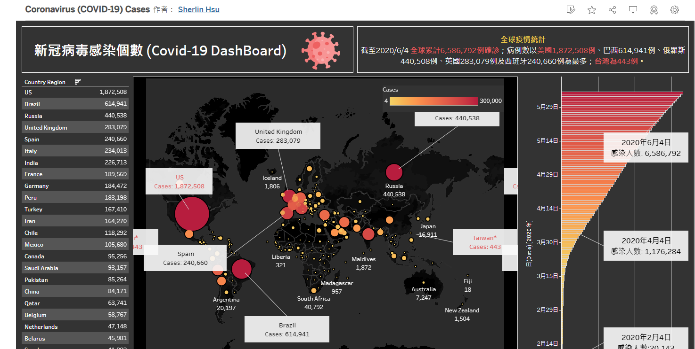

## Coronavirus(COVID-19)Cases

### :book: Information
#### 全球疫情統計截至2020/06/04，各個國家感染人數、每日新增確診人數、全球各國確診人數。

### :pencil2: Output
[觀看儀錶板](https://public.tableau.com/shared/45J3HWXHB?:display_count=n&:origin=viz_share_link)

